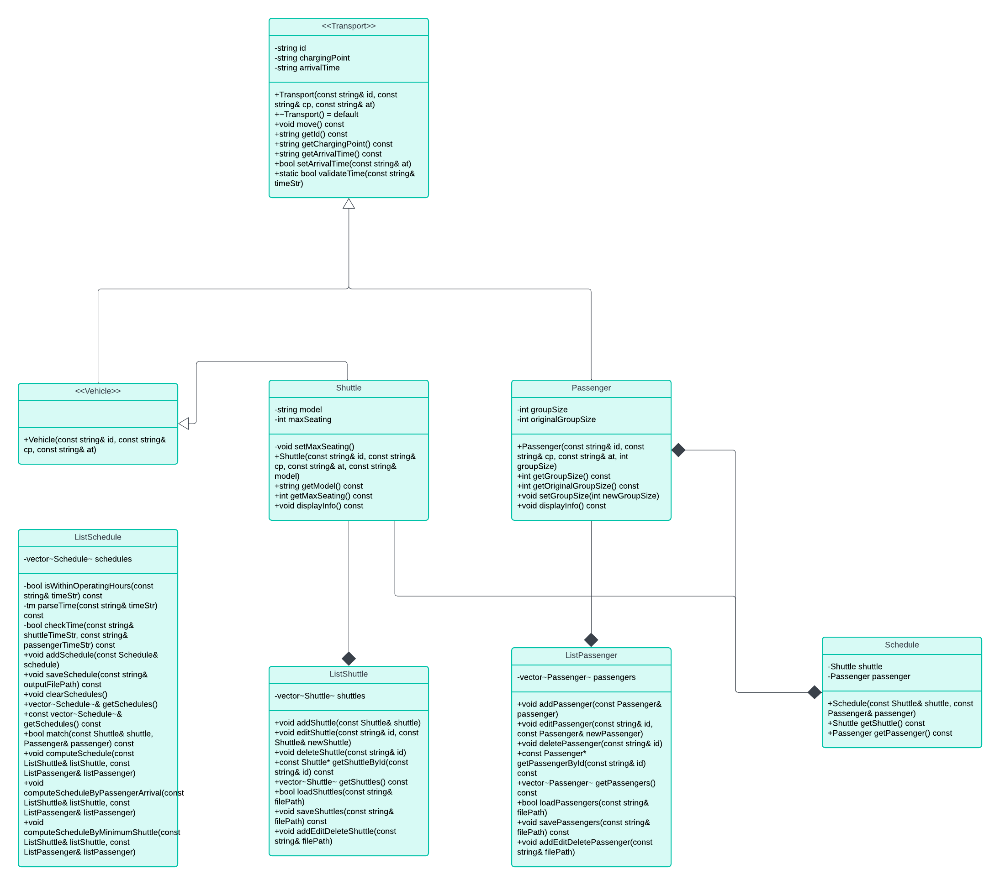

## UML Class Diagram



# Cpp-TransportSystem

A C++ application for managing transport schedules, shuttle assignments, and passenger bookings.

## Overview

Cpp-TransportSystem is a modular, object-oriented C++ project that simulates a basic transport management platform. It provides core functionality for registering passengers, defining shuttles, and scheduling transport between them under defined time constraints.

The system is designed using clean architectural principles and includes a clear separation between data models, scheduling logic, and file persistence.

## Features

- 🚌 Add and manage shuttles (model, capacity)
- 👥 Register passenger groups
- 🗓️ Schedule trips between shuttles and passengers
- ⏱ Validate time constraints and operating hours
- 💾 Load and save all data from/to text files
- 📊 View, list and manage current schedules
- 🧩 Modular OOP design with abstract base classes and derived components

## Technical Details

- **Language**: C++
- **Paradigm**: Object-Oriented Programming (Inheritance, Polymorphism, Encapsulation)
- **Data Structures**: `std::vector`, file streams
- **Structure**:
  - `Transport`, `Vehicle` (base classes)
  - `Shuttle`, `Passenger` (specialized types)
  - `Schedule` (links passenger ↔ shuttle)
  - `ListSchedule`, `ListPassenger`, `ListShuttle` (managers with file I/O)
- **Platform**: Windows, Visual Studio 2022

## Purpose

The project is developed as part of a software engineering course with the goal of applying object-oriented programming principles to a realistic, file-based scheduling scenario.

## 🛠 Installation & Usage

### 📅 Installation

1. **Requirements**
   - Make sure **Visual Studio 2022** is installed.
   - During setup, select the **"Desktop development with C++"** workload.

2. **Clone the project**
   ```bash
   git clone https://github.com/your-username/Cpp-TransportSystem.git
   cd Cpp-TransportSystem
   ```

3. **Open the project**
   - Open `Cpp-TransportSystem.sln` in Visual Studio 2022.
   - Let the IDE load all files and dependencies.

4. **Build the project**
   - Choose **Debug** or **Release** mode.
   - Click **Build → Build Solution** or press `Ctrl+Shift+B`.

---

### ▶️ Usage

The program runs as a terminal-based interface.

1. **Start the program**
   - Press `Ctrl+F5` in Visual Studio to run without the debugger.
   - A console window will open.

2. **Navigate menus**
   - You’ll see clear options like "Add new shuttle", "Register passengers", "Create schedule".
   - Enter your choice using numbers (e.g., `1` to add a shuttle).

3. **Files**
   - The program saves and loads data using `.txt` files:
     - `shuttles.txt`
     - `passengers.txt`
     - `schedules.txt`

4. **Example flow**
   - Add a shuttle with model name and capacity.
   - Register a passenger group (name, size).
   - Create a schedule between them.
   - Exit and restart the app to confirm data persistence.
